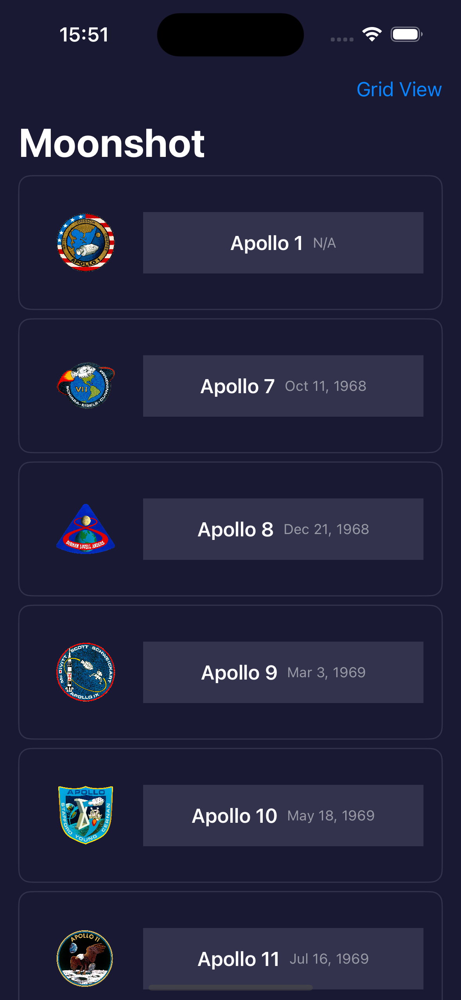
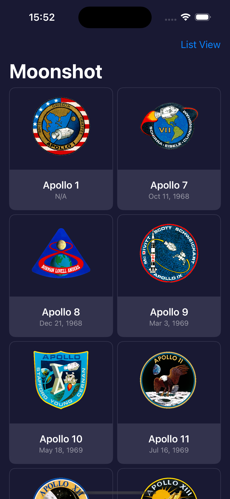
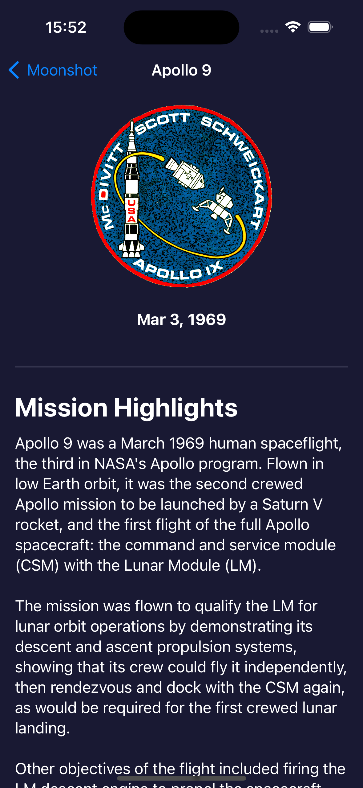
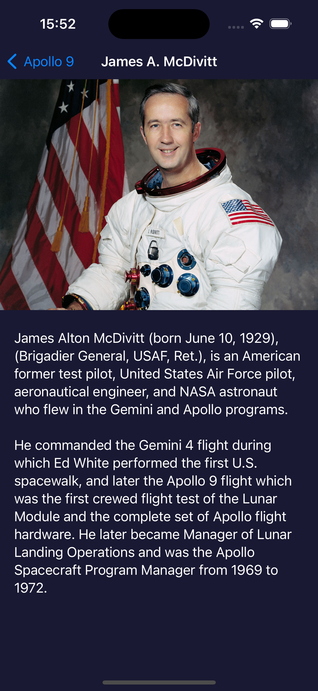

# Moonshot

Welcome to Moonshot, a project built as part of the 100 Days of SwiftUI challenge by Paul Hudson. This project showcases the use of SwiftUI to create a beautiful and informative app about the Apollo moon missions.

## Overview

Moonshot is an educational app that provides detailed information about the Apollo space missions, including the crew members, mission objectives, and historical context. The app features a visually appealing design with smooth animations and intuitive navigation.

## Features

- **Mission List**: A scrollable list of all Apollo missions with mission names and dates.
- **Mission Detail View**: Detailed view for each mission, including crew information, mission description, and images.
- **Astronaut Profiles**: Detailed profiles of the astronauts who participated in the missions.
- **Historical Context**: Background information on the Apollo program and the space race.

## Screenshots






## Requirements

- iOS 15.0+
- Xcode 13.0+
- Swift 5.5+

## Installation

1. Clone the repository:

    ```sh
    git clone https://github.com/OmPreetham/Moonshot.git
    ```

2. Open the project in Xcode:

    ```sh
    cd moonshot
    open Moonshot.xcodeproj
    ```

3. Build and run the project on your simulator or device.

## Usage

- **Browse Missions**: Open the app to see a list of Apollo missions. Tap on any mission to view more details.
- **View Astronauts**: In the mission detail view, tap on an astronaut's name to see their profile and learn more about their career and contributions to the space program.

## Acknowledgements

This project is part of the [100 Days of SwiftUI](https://www.hackingwithswift.com/100/swiftui) challenge by Paul Hudson. Special thanks to NASA for providing the historical data and images used in this app.

## License

This project is licensed under the MIT License. See the [LICENSE](LICENSE) file for more details.
